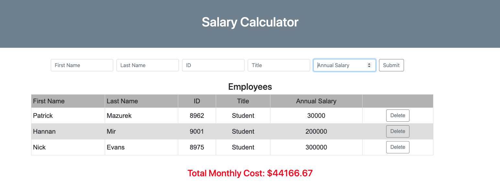

# Project Name

Monthly Salary Calculator

## Description

Duration: Two day sprint

This application receives user input and displays on that input on the DOM. More specifically, it takes user input one employee at a time, with categories: First Name, Last Name, Employee ID, Title. It stores the user input as employee objects and displays them individually as rows on a table.   It also calculates the monthly total salary of all employees present on the table. It displays that total salary cost in red if it is above $20,000 per month. The user is also able to remove employees from the table and receive an up to date monthly salary cost. 

The problem addressed here was determining a total monthly payroll cost. This application gives employers a quick snapshot of their total monthly payroll cost and warns if that cost breaches $20,000 a month.  

Screenshots are here : 